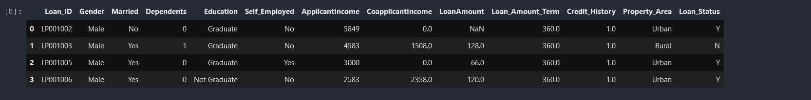
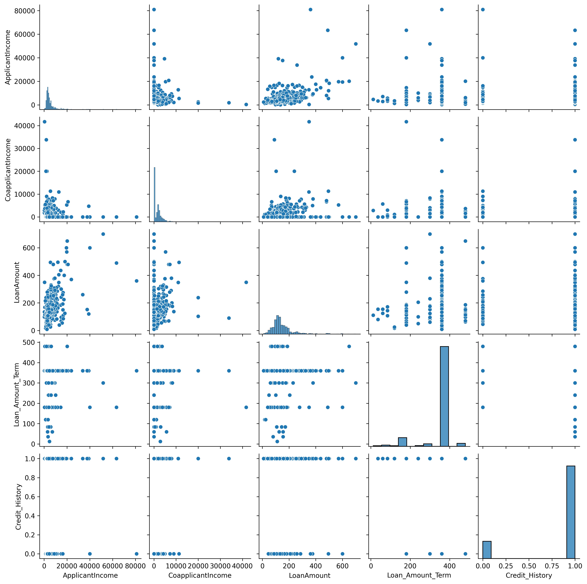
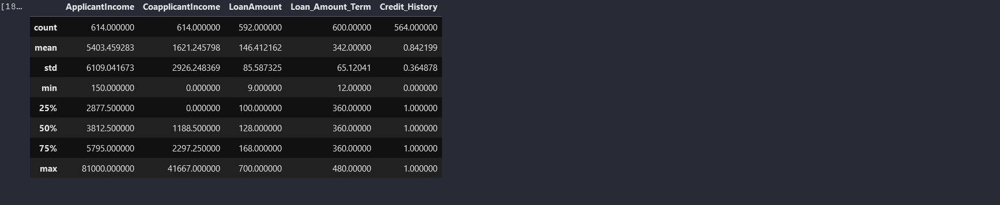
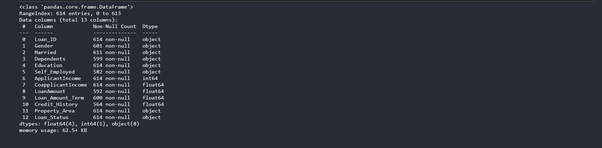
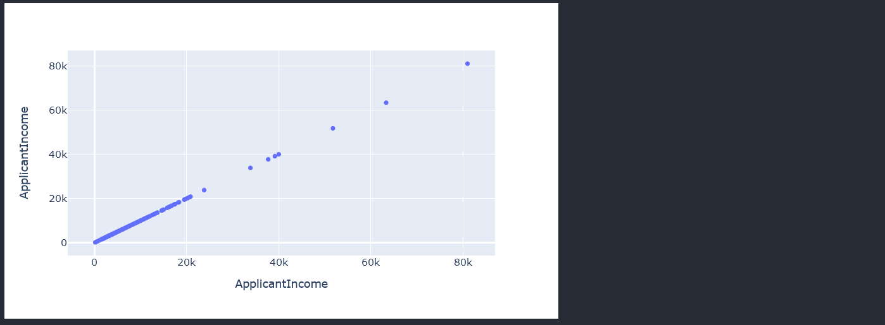
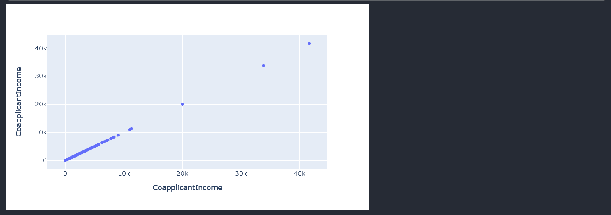
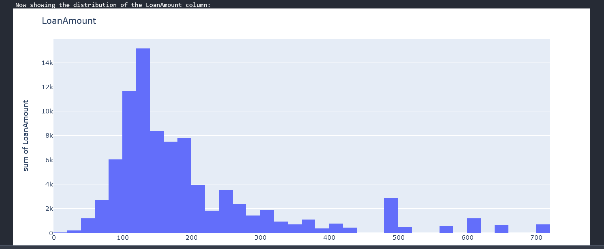
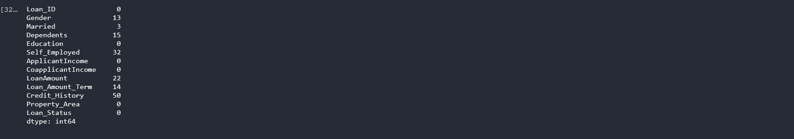
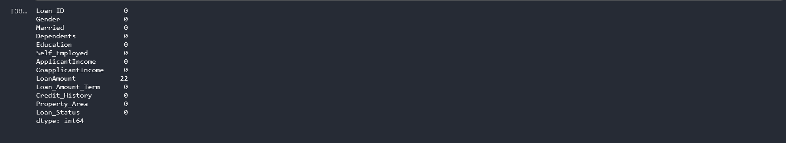
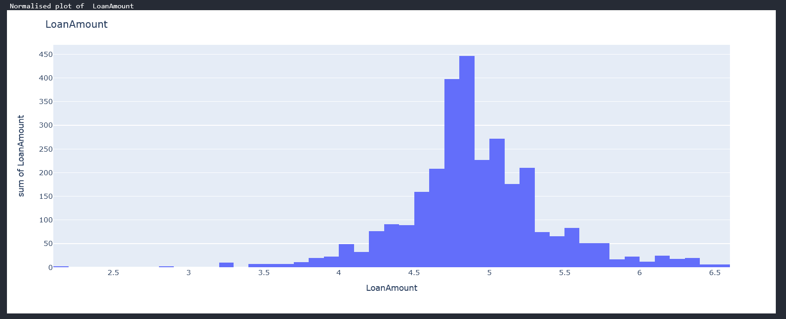

<SEO title="Loan prediction webapp" />

Angela has some disposable income that she wants to invest in a money lending business. This kind of business has several risk factors associated with it. How can Angela ake datadriven decisions on whom to lend money to?

<h2>Expectations</h2><br/>
The end goal is to make this a binary classification problem where given a set of inputs, the model either gives a prediction of approved or rejected. The approved prediction means Angela can go ahead and give the loan to the applicant while rejection means Angela will either have to revisit the decision manually or outright trust the model.

<h2>Loading the Data</h2>
For this problem, we will be using the dataset on loan prediction on Kaggle. You can download the data from <a href="https://www.kaggle.com/altruistdelhite04/loan-prediction-problem-dataset" target="_blank">here</a>.
<blockquote>You will need to use scikit-learn version 0.23.2 for the project to run smoothly.</blockquote>

```sh
 pip install -U scikit-learn==0.23.2

```
Import the relevant libraries needed

```py
    # Importing important libraries
    import pandas as pd
    import numpy as np
    import matplotlib.pyplot as plt
    import seaborn as sns
    import plotly
    import plotly.express as px
    import plotly.figure_factory as ff
    from sklearn.utils import resample
    from sklearn.preprocessing import StandardScaler , MinMaxScaler
    from collections import Counter
    from scipy import stats

```

```py
    #Classifiers
    from sklearn.ensemble import AdaBoostClassifier , GradientBoostingClassifier , VotingClassifier , RandomForestClassifier
    from sklearn.linear_model import LogisticRegression , RidgeClassifier
    from sklearn.discriminant_analysis import LinearDiscriminantAnalysis
    from sklearn.model_selection import RepeatedStratifiedKFold
    from sklearn.neighbors import KNeighborsClassifier
    from sklearn.model_selection import GridSearchCV
    from sklearn.tree import DecisionTreeClassifier

    from sklearn import tree
    from sklearn.naive_bayes import GaussianNB
    from xgboost import plot_importance
    from xgboost import XGBClassifier
    from sklearn.svm import SVC
```
```py
    #Model evaluation tools
    from sklearn.metrics import classification_report , accuracy_score , confusion_matrix
    from sklearn.metrics import accuracy_score,f1_score
    from sklearn.model_selection import cross_val_score
```

```py
    #Data processing functions
    from sklearn.preprocessing import StandardScaler
    from sklearn.model_selection import train_test_split
    from sklearn import model_selection
    from sklearn.preprocessing import LabelEncoder
    le = LabelEncoder()
```

Load the data from the csv. Replace <mark>"./path to csv"</mark> with where your data is located.

```py
train = pd.read_csv("./path to csv")
data = train.copy()

```
We load the dataset as a pandas dataframe and store it in <mark>train</mark>. We then make a copy of the train dataframe and store it in <mark>data</mark>. This allows to have a copy
of the original dataset then constantly manipulate the copy. If the need arises to use the original dataset, we will still have it to our disposal.

We can view our data as follows
```py
data.head(4)
```



<h2>Exploratory data analysis</h2>
We first draw a scatter plot of all variables against themselves in a bivariate fashion.

```py
sns.pairplot(data)
plt.show()
```

We need to understand the data we have to determine whether we have any outliers or missing values from the dataset. The describe function will help with this.

```py
data.describe()
```

From the above results from the describe function, we can see that some columns have missing values as indicated by the count. The standard deviation(std) also tells us more on how the data is distributed. Low standard deviation means data points are clustered around the mean, and high standard deviation indicates data is more spread out. We might need to investigate further on the data points on the ApplicantIncome and CoapplicantIncome columns as the std is too high which might indicate presence of outliers. Before we can do any manipulations we need to understand our column datatype using the info() function.

```py
data.info()

```

We have a dataset with 4 distinct datatype.

<h3>Handling outliers</h3>

From the std, we suspect having outliers in the Applicant Income and coapplicant income. Lets start by first visualising the distribution of the data in the ApplicantIncome to verify that we indeed have outliers that are accounting for the high std

```py
fig = px.scatter_matrix(data["ApplicantIncome"])
fig.update_layout(width=700,height=400)
fig.show()
```

The ApplicantIncome scatter plot visually confirms that the column has outliers. Next we work on the visualisation of the CoapplicantIncome column

```py
fig = px.scatter_matrix(data["CoapplicantIncome"])
fig.update_layout(width=700,height=400)
fig.show()
```


As expected, the visual plot of the Coapplicantincome also shows our outliers.

<blockquote>To make work easier as the notebook grows, I will be writing all our model predictions on an external txt</blockquote>

```py
import os
if os.path.exists("results.txt"):
   os.remove("results.txt")
else:
   print("The file does not exist")
def write_results_to_file(txt):

  f = open("results.txt","a")
  f.write(txt + '\n')
  f.close()
```
The above code just removes any old files named results.txt on our file system and creates one if it does not exist.

<h3>Checking the distribution of the data</h3>
Ideally,to get the best possible results our data needs to be in a normal distribution. Data in a normal distribution observes the bell curve.

```py
def check_distribution_of_column(column_name):
  fig = px.histogram(data[column_name],x =column_name,y = column_name)
  fig.update_layout(title=column_name)
  fig.show()


```
The function <mark>check_distribution_of_column</mark> takes in a column name and plots a histogram showing the distribution of data in that column.
We iterate through all the columns in our dataframe calling on our handy function to draw the distribution.

```py
for col in data.columns:
    print("Now showing the distribution of the " + col + " column:")
    check_distribution_of_column(col)
```
You should be having individual plots of each column. The loan amount plot looks like this

From the above graphs we can see that we have a mix of categorical variables and discrete variables. Categorical variables contain a finite number of categories or distinct groups. Categorical data might not have a logical order. For example, categorical predictors for our dataset are gender,marital status,self employed etc. Discrete variables are numeric variables that have a countable number of values between any two values for example the applicants income, coapplicantincome and loan amount. With all these, we can now begin some data cleaning.

<h2>Data CLeaning </h2>
From our EDA we have established we have some problems we need to fix with the data :
1. Deal with null values to ensure our data is of same length
2. Deal with outliers
3. Find a way of converting categorical variables to discrete variables since our model will expect to use discrete values.
4. Find a way to make the data normally distributed

<h3>1. Dealing with null values</h3>
We have a few options:

1. Drop all rows with at least one null value
2. Replace the null value with either the mode, mean or median of the column.

For the first approach, we do not have much data to work with as such I will be exploring the second option. Also dropping the null values doesnt necessarily mean that we will not be dropping more rows as we continue with the data cleaning. We might need to drop more rows in future and thus greatly reduce our dataset. Option 2 is our best bet.

```py
# shows number of missing values by column
data.isnull().sum()
```


For the categorical variables, I will use the mode of the column. For example, we have more men in the dataset so the probabilty of someone with a null value having being a man was higher than it being a woman.

```py
data["Gender"].fillna(data["Gender"].mode()[0],inplace=True)
data["Married"].fillna(data["Married"].mode()[0],inplace=True)
data["Self_Employed"].fillna(data["Self_Employed"].mode()[0],inplace=True)
data["Loan_Amount_Term"].fillna(data["Loan_Amount_Term"].mode()[0],inplace=True)
data["Dependents"].fillna(data["Dependents"].mode()[0],inplace=True)
data["Credit_History"].fillna(data["Credit_History"].mode()[0],inplace=True)

```
```py
# shows number of missing values by column
data.isnull().sum()
```


Now checking for null values, we notice only the LoanAmount still has nulls which is a discrete variable.To fix this we will use the median since we had already established an outlier for this column. Thus using the mean might not give an accurate representation of roughly how much might have been borrowed.

```py
data["LoanAmount"].fillna(data["LoanAmount"].median(),inplace=True)

```


All done with dealing with null values.

<h3>2. Dealing with outliers</h3>
We have three discrete variables of which two have outliers.

```py
data["ApplicantIncome"] = np.log(data["ApplicantIncome"])
#As "CoapplicantIncome" columns has some "0" values we will get log values except "0" since log 0 is undefined
data["CoapplicantIncome"] = [np.log(i) if i!=0 else 0 for i in data["CoapplicantIncome"]]
data["LoanAmount"] = np.log(data["LoanAmount"])
```
We apply the natural logarithm to all our discrete variables to normalise the data. Natural log transformations reduce skewness to our datasets.
Compare our loan amount distribution now with what we had above



<h3>3. Find a way of converting categorical variables to discrete variables since our model will expect to use discrete values.</h3>

With our normally distributed discrete data, we can now proceed to our categorical variables.

```py
discrete_columns=["ApplicantIncome","CoapplicantIncome","LoanAmount"]
Categorical_variables = np.array(list(filter(lambda x: x not in discrete_columns , data.columns)))

```

The above code stores all our categorical column names into a list.
The Loan_ID column does not help with our predictions so we drop it. You will not qualify for a loan just because your loan id is a certain value.

```py
# Dropping the Loan_ID from the variables
Categorical_variables = np.delete(Categorical_variables,0)
```

We will also drop our predictor variable for now

```py
# Dropping the Loan_Status from the variables since it is our Y
Categorical_variables = np.delete(Categorical_variables,-1)
```
Looks like we are done but a closer look at the Dependents, they are supposed to be an integer but have been represented as strings. For this we need to convert them to integers since they are discrete values not categorical variables.

```py
#All values of "Dependents" columns were of "str" form now converting to "int" form.
data["Dependents"] = data["Dependents"].replace('3+',int(3))
data["Dependents"] = data["Dependents"].replace('1',int(1))
data["Dependents"] = data["Dependents"].replace('2',int(2))
data["Dependents"] = data["Dependents"].replace('0',int(0))
```